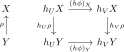

# 前層の圏

圏$\mathscr{C}$から圏$\mathscr{S}$への **反変函手** （contravariant functor）とは、函手$\mathscr{C}^{\mathrm{op}}\rightarrow\mathscr{S}$のことである。この文脈で通常の函手のことを共変函手とも言うが、本稿では「函手」という用語のみを用いることにする。反変・共変といった区別は口頭なら便利だが、記法としてはややこしい。

<p align=center></p>

__定義__ $\mathscr{C}$を圏とする。函手$\mathscr{C}^{\mathrm{op}}\rightarrow\mathbf{Set}$を$\mathscr{C}$上の **前層** （presheaf）と呼び、$\mathbf{Psh}(\mathscr{C}):=\mathbf{Funct}(\mathscr{C}^{\mathrm{op}}, \mathbf{Set})$を$\mathscr{C}$上の **前層の圏** と呼ぶ。

$\mathbf{Set}$の部分は環の圏$\mathbf{Ring}$や加群の圏$\mathbf{Mod}_{R}$、あるいはより一般の圏に置き換えることができる。このとき前層の圏は、環に値を持つ前層の圏、加群に値を持つ前層の圏などと呼ぶ。

> 前層の圏は、元の圏$\mathscr{C}$に$\mathbf{Set}$の構造を付与して膨らませたものと解釈できる。実際、後述する米田の補題は、圏$\mathscr{C}$が$\mathbf{Psh}(\mathscr{C})$に忠実充満に埋め込めることを主張する。このように元の構造を残したまま世界を広げることでこれまで見えてなかったものが見えるようになる。

$\mathscr{C}$を圏、$U\in\mathscr{C}$とする。

- 対象$X\in\mathscr{C}$に対して、$h_{U}X:=\mathrm{Mor}_{\mathscr{C}}(X, U)$とする。
- 射$\rho\colon X\leftarrow Y$に対して、$h_{U}\rho\colon\mathrm{Mor}_{\mathscr{C}}(X, U)\rightarrow\mathrm{Mor}_{\mathscr{C}}(Y, U)$を$f\mapsto f\circ\rho$とする。

このとき$h_{U}$は$\mathscr{C}$の前層となる。つまり$h_{U}\colon\mathscr{C}^{\mathrm{op}}\rightarrow\mathbf{Set}$は函手である。

次に$\phi\colon U\rightarrow V$を射とする。対象$X\in\mathscr{C}$について$(h\phi)_{X}\colon h_{U}X\rightarrow h_{V}X$を$f\mapsto \phi\circ f$とする。このとき$h\phi\colon h_{U}\rightarrow h_{V}$は自然変換となる。

実際、射$\rho\colon X\leftarrow Y$について以下の図式が可換となる。

<p align=center></p>

つまり$f\in h_{U}X$に対し、$h_{V}\rho\circ(h\phi)_{X}(f)=h_{V}\rho(\phi\circ f)=\phi\circ f\circ\rho$であり、$(h\phi)_{Y}\circ h_{U}\rho(f)=(h\phi)_{Y}(f\circ\rho)=\phi\circ f\circ\rho$より一致する。

このとき以下で定まる$h\colon\mathscr{C}\rightarrow\mathbf{Psh}(\mathscr{C})$は函手である。

- 対象$U\in\mathscr{C}$に対し、$h_{U}\in\mathbf{Psh}(\mathscr{C})$を対応させる。
- 射$\phi\colon U\rightarrow V$に対し、自然変換$h\phi\colon h_{U}\rightarrow h_{V}$を対応させる。

__定義__ $\mathscr{C}$を圏とする。函手$h\colon\mathscr{C}\rightarrow\mathbf{Psh}(\mathscr{C})$を **米田函手** （Yoneda functor）と呼ぶ。


## 前層の圏の性質


<details>
<summary>LaTeXソース</summary>

```latex
% プリアンブル
\usepackage{amsmath, amssymb, mathrsfs}
\usepackage{tikz-cd}
```

```latex
% psh_01.svg
\begin{tikzcd}[contains/.style = {phantom, "\ni", sloped}]
X & FX \arrow[d, "F\rho",  ""'{name=V}] \\
Y \arrow[u, "\rho",  ""'{name=U}] & FY
\arrow[from=U, to=V, "F", dashed]
\end{tikzcd}
```

```latex
% psh_02.svg
\begin{tikzcd}[contains/.style = {phantom, "\ni", sloped}]
X & h_{U}X \arrow[d, "h_{U}\rho"'] \arrow[r, "(h\phi)_{X}"] & h_{V}X \arrow[d, "h_{V}\rho"] \\
Y \arrow[u, "\rho"] & h_{U}Y \arrow[r, "(h\phi)_{Y}"'] & h_{V}Y
\end{tikzcd}
```

</details>


