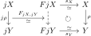
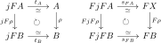
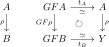
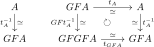
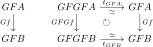

# 忠実充満函手と部分圏

## 圏同値の特徴付け

__定義__ 函手$F\colon\mathscr{A}\rightarrow\mathscr{B}$について以下を定義する。

- 任意の$A, B\in\mathscr{A}$に対し$F_{A, B}$が単射のとき、$F$は **忠実** （faithfull）という。
- 特に$F_{A, B}$が全単射のとき、$F$は **忠実充満** （fully faithfull）という。
- 任意の対象$X\in\mathscr{B}$に対し、ある対象$A\in\mathscr{A}$が存在して$FA\simeq X$のとき、$F$は **本質的全射** （essentially surjective）という。

忠実函手は図式を保存する。実際$\alpha, \beta, \gamma, \delta\in\mathrm{Mor}(\mathscr{A})$について$F\alpha\circ F\beta=F\gamma\circ F\delta$なら$F(\alpha\circ\beta)=F(\gamma\circ\delta)$より忠実性から$\alpha\circ\beta=\gamma\circ\delta$を得る。逆も函手性から明らかなので両者は同値となる。

> $\mathscr{A}$の図式を$\mathscr{B}$において「忠実」に再現するということだろうか。

__命題__ 忠実充満函手は対象上同型を除いて単射である。

（証明）函手$F\colon\mathscr{A}\rightarrow\mathscr{B}$は忠実充満とする。$A, B\in\mathscr{A}$について$f\colon FA\xrightarrow{\simeq}FB$とすると、ある$g\colon A\rightarrow B, h\colon B\rightarrow A$が存在して$Fg=f, Fh=f^{-1}$を満たす。$F(h\circ g)=Fh\circ Fg=\mathrm{id}_{FA}=F\mathrm{id}_{A}$より$h\circ g=\mathrm{id}_{A}$であり、同様に$g\circ h=\mathrm{id}_{B}$である。故に$A\simeq B$を得る。$\square$

__例__ 群$G, H$と群準同型$\phi\colon G\rightarrow H$について、函手$F\colon\circlearrowright^{G}\rightarrow\circlearrowright^{H}$が$g\mapsto \phi(g)$により定まる。それぞれ単一の対象が対応するので$F$は本質的全射である。このとき$F$が忠実とは$\phi$が単射のことであり、$F$が忠実充満とは$\phi$が全単射（よって同型）のことである。

> 次の補題は、条件に関して$F$は本質的全射と言いたくなるかもしれないが、その場合$j$の存在に選択公理が必要となるためこういう書き方をしている。最終的な主張は後で述べる定理である。

__補題__ 函手$F\colon\mathscr{A}\rightarrow\mathscr{B}$は忠実充満とする。任意の$X\in\mathscr{B}$について$j(X)\in\mathscr{A}$が存在して同型$s_{X}\colon F(j(X))\xrightarrow{\simeq}X$が与えられているとする。このとき$F$は圏同値である。

（証明）函手$j\colon\mathscr{B}\rightarrow\mathscr{A}$を以下で構成する。

- 対象$X\in\mathscr{B}$に対し、$jX:=j(X)$とする。
- 対象$X, Y\in\mathscr{B}$及び射$\rho\colon X\rightarrow Y$に対し、$j\rho:=F_{jX, jY}^{-1}(s_{Y}^{-1}\circ\rho\circ s_{X})$とする。

<p align=center></p>


$j$が函手となることを示す。$\tau\colon Y\rightarrow Z$に対し

$$
\begin{aligned}
F(j(\tau\circ\rho))&=F(F_{jX, jY}^{-1}(s_{Z}^{-1}\circ\tau\circ\rho\circ s_{X}))=s_{Z}^{-1}\circ\tau\circ\rho\circ s_{X} \\
&=(s_{Z}^{-1}\circ\tau\circ s_{Y})\circ(s_{Y}^{-1}\circ\rho\circ s_{X})=F(j\tau)\circ F(j\rho) \\
&=F(j\tau\circ j\rho)
\end{aligned}
$$

より$F$の忠実性から$j(\tau\circ\rho)=j\tau\circ j\rho$が成り立つ。また$s_{X}^{-1}\circ\mathrm{id}_{X}\circ s_{X}=\mathrm{id}_{FjX}$は恒等射の一意性より従う。よって函手$F$は恒等射を恒等射に写すから$j\mathrm{id}_{X}=\mathrm{id}_{jX}$を得る。

$s=(s_{X})_{X\in\mathscr{B}}\colon F\circ j\rightarrow \mathrm{id}_{\mathscr{B}}$が同型な自然変換となることも上の図から明白だろう。

逆に$A\in\mathscr{A}$について$t_{A}=F_{jFA, A}^{-1}(s_{FA})\colon jFA\rightarrow A$とおく。$s_{FA}\colon FjFA\xrightarrow{\simeq}FA$は同型だから先の命題より$t_{A}$も同型である。$t=(t_{A})_{A\in\mathscr{A}}$が自然変換であることも$s$の自然性より従う。実際$\rho\colon A\rightarrow B$に対し$F\rho\circ s_{FA}=s_{FB}\circ FjF\rho$だから$\rho\circ t_{A}=t_{B}\circ jF\rho$が分かる。

<p align=center></p>

以上より$t\colon j\circ F\rightarrow\mathrm{id}_{A}$は同型な自然変換なので、$F$は圏同値である。$\square$

__定理__ 函手$F\colon\mathscr{A}\rightarrow\mathscr{B}$について以下は同値である。

1. $F$は圏同値である。
1. $F$は忠実充満かつ本質的全射である。

（証明）$F$は圏同値とする。つまり函手$G\colon\mathscr{B}\rightarrow\mathscr{A}$が存在して$t\colon G\circ F\xrightarrow{\simeq}\mathrm{id}_{\mathscr{A}}, s\colon F\circ G\xrightarrow{\simeq}\mathrm{id}_{\mathscr{B}}$を満たす。

まず$A, B\in\mathscr{A}$について$F_{A, B}$が単射であることを示そう。$f\in\mathrm{Mor}(FA, FB)$に対して$\xi(f):=t_{B}\circ Gf\circ t_{A}^{-1}$と定める。このとき$\rho\colon A\rightarrow B$に対して$t$の自然性より$\xi(F\rho)=t_{B}\circ GF\rho\circ t_{A}^{-1}=\rho$である。

<p align=center></p>

よって$\rho, \tau\in\mathrm{Mor}(A, B)$について$F\rho=F\tau$とすると、$\rho=\xi(F\rho)=\xi(F\tau)=\tau$より$\rho=\tau$を得る。つまり$F_{A, B}$は単射である。故に$F$が忠実であることが示されたが、同様に$s$の自然性より$G$も忠実であることに注意する。

次に$F_{A, B}$が全射であることを示そう。そこで$F\xi(f)=f$を示したい。注意で述べたように$G$は忠実なので

$$
GF\xi(f)=GF(t_{B}\circ Gf\circ t_{A}^{-1})=GFt_{B}\circ GFGf\circ GFt_{A}^{-1}
$$

が$Gf$と一致することを示せば良い。そこで$t_{A}^{-1}\colon A\xrightarrow{\simeq}GFA$に着目すると、$t$の自然性より$t_{GFA}\circ GFt_{A}^{-1}=t_{A}^{-1}\circ t_{A}=\mathrm{id}_{GFA}$となる。つまり$GFt_{A}^{-1}=t_{GFA}^{-1}$である。

<p align=center></p>

同様に$GFt_{B}=t_{GFB}$だから$GF\xi(f)=t_{GFB}\circ GFGf\circ t_{GFA}^{-1}$となるが、ここで$Gf\colon GFA\rightarrow GFB$に対して$t$の自然性より$Gf\circ t_{GFA}=t_{GFB}\circ GFGf$となる。故に$GF\xi(f)=Gf$より$F_{A, B}$は全射である。

<p align=center></p>


以上で$F$が忠実充満であることが示された。本質的全射であることは$X\in\mathscr{B}$に対して$A:=GX\in\mathscr{A}$を取れば同型$s_{X}\colon FA=FGX\xrightarrow{\simeq}X$が成り立つことから従う。

逆に$F$が忠実充満かつ本質的全射とする。本質的全射性より$X\in\mathscr{B}$について$FA\simeq X$となる$A\in\mathscr{A}$が存在するから、選択公理より対象$G(X)\in\mathscr{A}$と同型射$s_{X}\colon FG(X)\xrightarrow{\simeq}X$が取れる。補題より$F$は圏同値となる。$\square$


## 部分圏

__定義__ $\mathscr{B}$を圏とする。$\mathrm{Ob}(\mathscr{A})\subset\mathrm{Ob}(\mathscr{B})$及び$\mathrm{Mor}(\mathscr{A})\subset\mathrm{Mor}(\mathscr{B})$は以下を満たすとする。
- 任意の$X\in\mathrm{Ob}(\mathscr{A})$について$\mathrm{id}_{X}\in\mathrm{Mor}(\mathscr{A})$である。
- 任意の$f\in\mathrm{Mor}(\mathscr{A})$について$\mathrm{dom}(f), \mathrm{cod}(f)\in\mathrm{Ob}(\mathscr{A})$である。
- $f, g\in\mathrm{Mor}(\mathscr{A})$について合成が$\mathscr{B}$において定義されるときは$g\circ f\in\mathrm{Mor}(\mathscr{A})$である。

このとき$\mathscr{A}=(\mathrm{Ob}(\mathscr{A}), \mathrm{Mor}(\mathscr{A}), \mathrm{dom}, \mathrm{cod}, \circ)$は圏であり **部分圏** （subcategory）と呼び$\mathscr{A}\subset\mathscr{B}$と表す。

部分圏$\mathscr{A}\subset\mathscr{B}$に対して対象と射をそのまま対応させることで、包含函手$\mathrm{incl}\colon\mathscr{A}\rightarrow\mathscr{B}$が定まる。

> 「言葉としての圏論」なら、部分圏の概念を用いれば「大きな圏」について記述することも可能である。部分圏としての「小さな圏」を考え、必要に応じて広げて行けばよい。例えば函手$F\colon\mathscr{A}\rightarrow\mathscr{B}$について$\mathscr{B}$が「大きな圏」である場合、$F$の値域は集合なので$F$は数学的対象となる。

__定義__ 部分圏$\mathscr{A}\subset\mathscr{B}$について以下を定める。

- 任意の$X, Y\in\mathscr{A}$について$\mathrm{Mor}_{\mathscr{A}}(X, Y)=\mathrm{Mor}_{\mathscr{B}}(X, Y)$が成り立つとき、**充満部分圏** （full subcategory）という。
- 任意の$X\in\mathscr{B}$と$Y\in\mathscr{A}$について、$A\simeq_{\mathscr{B}}B$なら$A\in\mathscr{A}$が成り立つとき、**isomorphism-closed** という。


<details>
<summary>LaTeXソース</summary>

```latex
% プリアンブル
\usepackage{amsmath, amssymb, mathrsfs}
\usepackage{tikz-cd}
```

```latex
% subcat_01.svg
\begin{tikzcd}[contains/.style = {phantom, "\ni", sloped}]
jX \arrow[d, ""{name=U}, "j\rho"' ] & FjX \arrow[r, "s_{X}", "\simeq"'] \arrow[d, dashed, ""'{name=V}] \arrow[dr, phantom, "\circlearrowright"] & X \arrow[d, "\rho"] \\
jY & FjY \arrow[r, "\simeq", "s_{Y}"'] & Y
\arrow[from=U, to=V, "F_{jX, jY}", "\simeq"']
\end{tikzcd}
```

```latex
% subcat_02.svg
\begin{tikzcd}[contains/.style = {phantom, "\ni", sloped}]
jFA \arrow[r, "t_{A}", "\simeq"'] \arrow[d, "jF\rho"'] \arrow[dr, phantom, "\circlearrowright"] & A \arrow[d, "\rho"] & FjFA \arrow[r, "s_{FA}", "\simeq"'] \arrow[d, "FjF\rho"'] \arrow[dr, phantom, "\circlearrowright"] & FX \arrow[d, "F\rho"] \\
jFB \arrow[r, "\simeq", "t_{B}"'] & B & FjFB \arrow[r, "\simeq", "s_{FB}"'] & FB
\end{tikzcd}
```

```latex
% subcat_03.svg
\begin{tikzcd}[contains/.style = {phantom, "\ni", sloped}]
A \arrow[d, "\rho"'] & GFA \arrow[r, "t_{A}", "\simeq"'] \arrow[d, "GF\rho"'] \arrow[dr, phantom, "\circlearrowright"] & A \arrow[d, "\rho"] \\
B & GFB \arrow[r, "\simeq", "t_{B}"'] & Y
\end{tikzcd}
```

```latex
% subcat_04.svg
\begin{tikzcd}[contains/.style = {phantom, "\ni", sloped}]
A \arrow[d, "t_{A}^{-1}"', "\simeq"] & GFA \arrow[r, "t_{A}", "\simeq"'] \arrow[d, "GFt_{A}^{-1}"', "\simeq"] \arrow[dr, phantom, "\circlearrowright"] & A \arrow[d, "t_{A}^{-1}", "\simeq"'] \\
GFA & GFGFA \arrow[r, "\simeq", "t_{GFA}"'] & GFA
\end{tikzcd}
```

```latex
% subcat_05.svg
\begin{tikzcd}[contains/.style = {phantom, "\ni", sloped}]
GFA \arrow[d, "Gf"'] & GFGFA \arrow[r, "t_{GFA}", "\simeq"'] \arrow[d, "GFGf"'] \arrow[dr, phantom, "\circlearrowright"] & GFA \arrow[d, "Gf"] \\
GFB & GFGFB \arrow[r, "\simeq", "t_{GFB}"'] & GFB
\end{tikzcd}
```

</details>

<!--
```latex {cmd}
\documentclass{standalone}
\usepackage{amsmath, amssymb, mathrsfs}
\usepackage{tikz-cd}
\begin{document}

\begin{tikzcd}[contains/.style = {phantom, "\ni", sloped}]
X \arrow[d, "\rho"'] & GFX \arrow[r, "t_{X}", "\simeq"'] \arrow[d, "GF\rho"'] \arrow[dr, phantom, "\circlearrowright"] & X \arrow[d, "\rho"] \\
Y & GFY \arrow[r, "\simeq", "t_{Y}"'] & Y &
\end{tikzcd}

\end{document}
```
-->